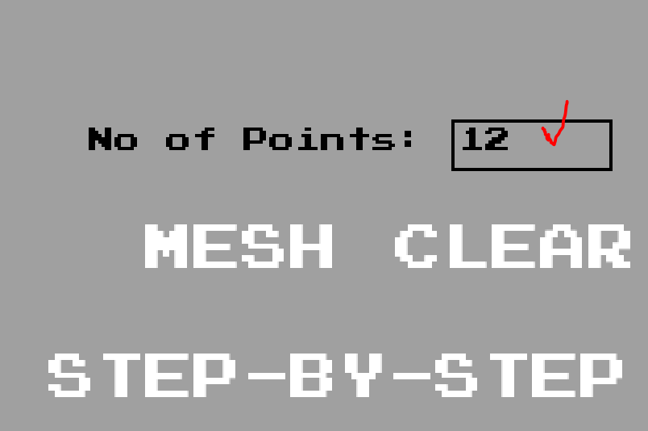

# CS478-Delaunay-Triangulation
Implementation of Two Delaunay Triangulation Algorithms and Comparing Their Performances

## Installation
Make sure you have Python version 3.8+ installed on your computer. We require 
two Python libraries for this project which are NumPy and PyGame.

``pip install numpy``  
``pip install pygame``

## Running
After successful installation, you can either create a run configuration for the 
"main.py" file from your selected IDE or run the following command from the terminal
inside the folder where main.py is:

``python main.py`` 

## User Manual
The only hardware required is a keyboard and a mouse. 
The buttons are given in white text format which will highlight to a different color when 
your mouse is hovering on top. 

The only input field is the "No of Points" field which require the user to 
***click on the rectangle*** to be able to write numerical values from the keyboard.

Clicking on the graph will let the users to zoom in the graph. Clicking again, 
while in zoom mode, will deactivate the zoom.